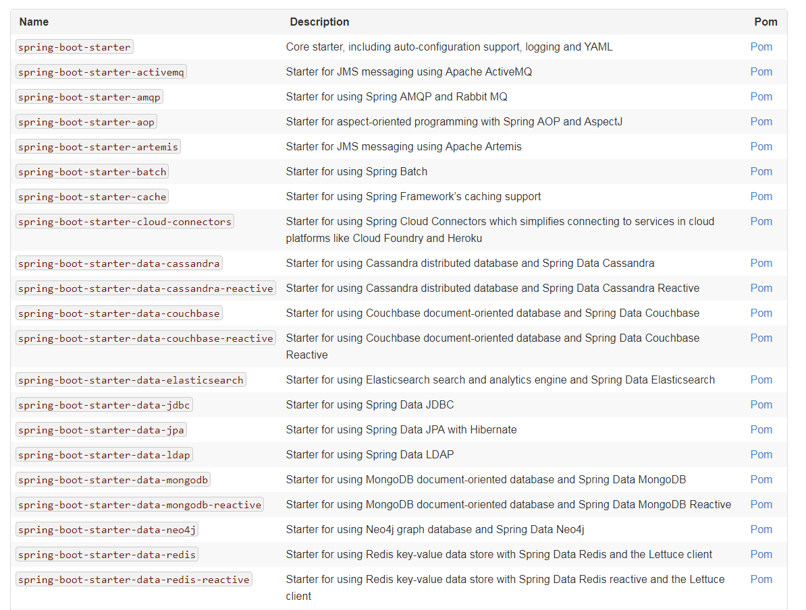
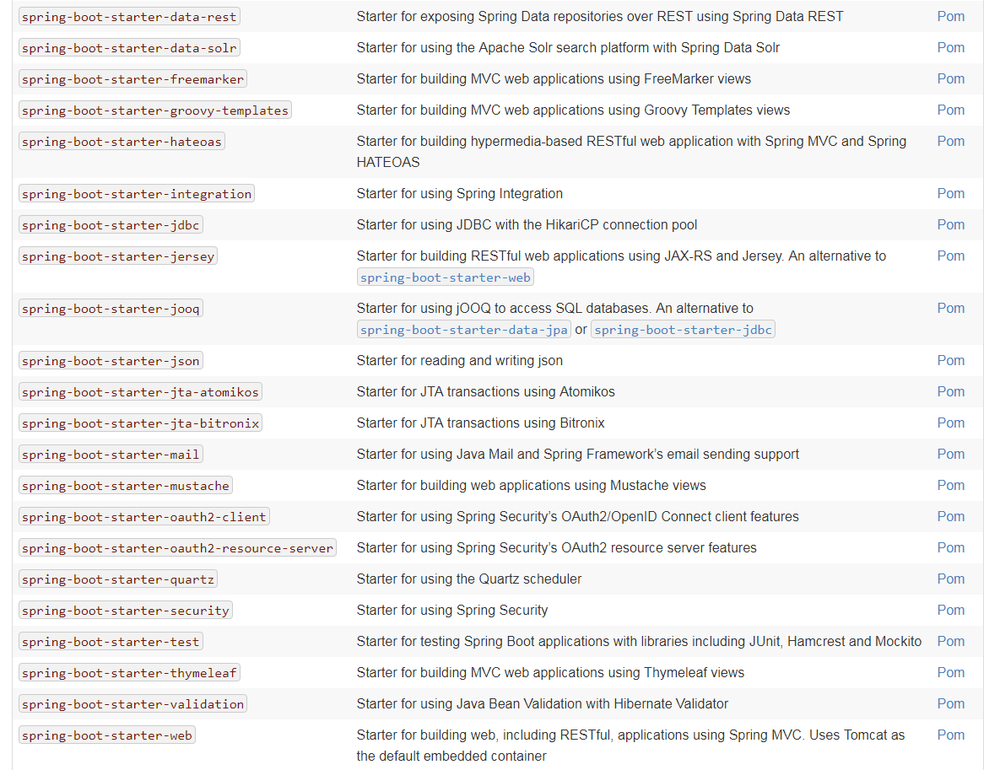
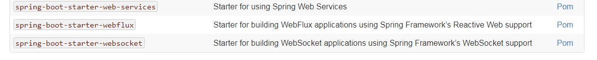
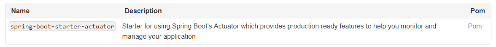
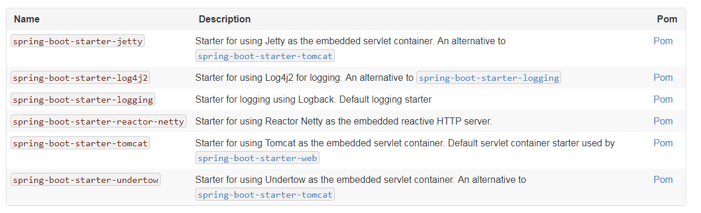

本节将更详细地介绍如何使用 `Spring boot`。它涵盖了构建系统、自动配置以及如何运行应用程序等主题。我们还介绍了一些 `Spring boot` 的最佳实践。尽管 `Spring boot` 并没有什么特别的地方(它只是另一个您可以使用的库)，但是有一些建议，在遵循这些建议时，可以使您的开发过程更容易一些。

### 1 构建系统

我们在之前的笔记提到过 ， 我们强烈建议使用 Maven 或者 Gradle 构建工具， 可以很方便的引入 jar 包和升级 `Spring boot`

maven 用户可以继承 `spring-boot-starter-parent` 来引入一些默认的配置，它包括一下特征：

- 默认编译版本为 java 1.8
- UTF-8 编码
- 依赖项管理部分，继承自 `spring-boot-dependencies` pom，用于管理常见依赖项的版本。当您在自己的pom中使用这些依赖项时，这种依赖项管理允许您省略这些依赖项的标签 （统一指定spring boot 版本，引入的其他 spring boot 依赖不需要指定 `<version>` 标签，当然也可以通过指定 `<versino>` 标签来覆盖它）。
- 合理的资源过滤
- 合理的插件配置（exec plugin, Git commit ID, and shade）

您还可以通过覆盖自己项目中的属性来覆盖单个依赖项。例如，要升级到另一个Spring数据发布系列，您需要将以下内容添加到您的pom.xml中：

	<properties>
		<spring-data-releasetrain.version>Fowler-SR2</spring-data-releasetrain.version>
	</properties>

#### 1.1 不引人 `spring-boot-starter-parent` 的构建方式

[https://docs.spring.io/spring-boot/docs/2.1.1.RELEASE/reference/htmlsingle/#using-boot-maven-without-a-parent](https://docs.spring.io/spring-boot/docs/2.1.1.RELEASE/reference/htmlsingle/#using-boot-maven-without-a-parent)

使用 ant 或者 gradle 构建的方式，也可以从以上链接中查看

### 2 Starters

Starts 是一些可以直接便利的引入的 `spring boot` 依赖，官方提供了很多方便的依赖 ，他们都是以 `spring-boot-starter-*` 的格式命名， `* ` 代表具体应用的名称 ， 当然你也可以导入第三方的 `Starts` ,第三方依赖没有这样的命名要求，但是 `group id` 还是一样的。

官方 `starts` 列表:

#### 2.1 生产 STARTS

可以用来监控应用的生产环境状态：

#### 2.2 工艺 Starts

比如服务器设置，或者日志框架设置

### 3 构建代码

虽然 `Spring boot` 的运行不需要啥特定的目录结构 ， 但是这又一些很有帮助的实战案例。

#### 3.1 main 方法的位置

建议将 `main()` 方法所在类的位置放在应用的更目录下，  @SpringBootApplication 注解经常会出现在 `main()` 方法包含的类中 ， 它隐式的为某些项创建了一个搜索基础包。例如，你要写一个 JPA 程序，它可以用来在该包搜索 `@Entity ` 项， 使用 root package 也可以使组件扫描只应用于你的项目中。

如果不想使用 `@SpringBootApplication` 也可以使用 `@EnableAutoConfiguration` 和 `@ComponentScan` 代替。

下面是一个典型的宝结构：

	com
	 +- example
	     +- myapplication
	         +- Application.java
	         |
	         +- customer
	         |   +- Customer.java
	         |   +- CustomerController.java
	         |   +- CustomerService.java
	         |   +- CustomerRepository.java
	         |
	         +- order
	             +- Order.java
	             +- OrderController.java
	             +- OrderService.java
	             +- OrderRepository.java 

### 4 配置类

`Spring boot` 喜欢使用 `Java-based ` 的配置方式 ， 当然 xml 的方式也是支持的， 我们建议使用单一的带有 `@Configuration` 的类进行配置 ，它通常是带有 `main` 方法的入口类，

#### 4.1 导入额外的配置类

不必须吧所有 `@Configuration ` 到放在一个单一的类中 ， 可以使用 `@Import` 注解导入额外的配置类 ，也可以使用 `@ComponentScan` 来扫描素有spring 组件 ，它包含了 `@Configuration` ,这两个二选一。

#### 4.2 导入 XML 配置

建议你还是在 `@Configuration` 类中 ， 使用 `@ImportResource` 注解导入 xml 配置文件中的配置。

### 5 自动配置

之前提到过 ， `spring boot` 可以根据引入的依赖尝试自动配置你的项目 ， 将 `@EnableAutoConfiguration ` 或 ` @SpringBootApplication`其中一个引入至你的 `@Configuration`类中。

#### 5.1 替换部分自动配置

在任何节点你都可以定义自己的配置来替换某部门的配置  ， 比如你添加了你自己的 `DataSource` ,自动配置的 `DataSource` 就会失效。

如果您需要了解当前正在应用了那些自动配置，以及原因，请使用 `——debug` 启动应用程序。这样做可以为选择的核心日志记录器创建调试日志，并将条件报告记录到控制台。

#### 5.2 排除某些配置

如果你不想使用自动配置的某些特定的配置 ， 可以使用 `@EnableAutoConfiguration` 的属性来禁止它：

	import org.springframework.boot.autoconfigure.*;
	import org.springframework.boot.autoconfigure.jdbc.*;
	import org.springframework.context.annotation.*;
	
	@Configuration
	@EnableAutoConfiguration(exclude={DataSourceAutoConfiguration.class})
	public class MyConfiguration {
	}

如果类不在类路径中，则可以使用 `excludeName` 注解属性并指定完全限定名来排除它。最后，您还可以使用 `spring.autoconfigure.exclude` 属性来控制要排除的自动配置类的列表。

### 6 Spring beans 和依赖注入

你可以自由的使用任何标准的 Spring 技术来定义 `bean` 和他们之间的依赖注入。为简单起见，我们经常使用 `@ComponentScan` 来找到 `beanS ` 然后用 `@Autowired ` 来注入 `beans` 

如果你按照之前建议额方式来构建你的代码（将启动类放在根目录） ， 那你在添加 `@ComponentScan` 的时候不需要添加任何参数，你应用中所有的组件（@Component, @Service, @Repository, @Controller 等） 都会自动的注入到你的 `SPRING BEANS` 中。

下面是一个例子，用来展示一个 `@Service bean` 通过构造注入的方式 ，获取一个 `RiskAssessor bean`:

	package com.example.service;
	
	import org.springframework.beans.factory.annotation.Autowired;
	import org.springframework.stereotype.Service;
	
	@Service
	public class DatabaseAccountService implements AccountService {
	
		private final RiskAssessor riskAssessor;
	
		@Autowired
		public DatabaseAccountService(RiskAssessor riskAssessor) {
			this.riskAssessor = riskAssessor;
		}
	
		// ...
	
	}

如果这个 `bean ` 只有一个构造函数， `@Autowired` 可以省略：

	@Service
	public class DatabaseAccountService implements AccountService {
	
		private final RiskAssessor riskAssessor;
	
		public DatabaseAccountService(RiskAssessor riskAssessor) {
			this.riskAssessor = riskAssessor;
		}
	
		// ...
	
	}

* 请注意，使用构造函数注入是如何将 `riskAssessor` 字段标记为final的，这表明它不能随后更改。

### 7 `@SpringBootApplication` 注解的使用

许多 `Spring boot` 开发人员喜欢他们的应用程序使用自动配置、组件扫描，并能够在“应用程序类”上定义额外的配置,一个单一的 `@SpringBootApplication` 就能够支持一下三个特征：

- @EnableAutoConfiguration: 自动配置机制
- @ComponentScan: 扫面应用程序所在的包
- @Configuration: 允许在上下文中注册额外的 `bean` 或导入其他配置类

` @SpringBootApplication` 等价于使用 `@Configuration` , `@EnableAutoConfiguration` , 和 `@ComponentScan`的默认属性 , 下面是一个例子：

	package com.example.myapplication;
	
	import org.springframework.boot.SpringApplication;
	import org.springframework.boot.autoconfigure.SpringBootApplication;
	
	@SpringBootApplication // same as @Configuration @EnableAutoConfiguration @ComponentScan
	public class Application {
	
		public static void main(String[] args) {
			SpringApplication.run(Application.class, args);
		}
	
	}

`@SpringBootApplication` 还提供别名来定制 `@EnableAutoConfiguration` 和 `@ComponentScan` 的属性。

这些特性都不是必须的，您可以选择用它支持的任何特性替换这个注释。例如，您可能不希望在应用程序中使用组件扫描:

	package com.example.myapplication;
	
	import org.springframework.boot.SpringApplication;
	import org.springframework.context.annotation.ComponentScan
	import org.springframework.context.annotation.Configuration;
	import org.springframework.context.annotation.Import;
	
	@Configuration
	@EnableAutoConfiguration
	@Import({ MyConfig.class, MyAnotherConfig.class })
	public class Application {
	
		public static void main(String[] args) {
				SpringApplication.run(Application.class, args);
		}
	
	}

在本例中，应用程序与其他任何 `·Spring boot` 应用程序一样，除了 `@component` 注解类不会自动检测到，而且用户定义的 `bean` 是显式导入的(请参见 `@Import`)。

### 8 运行你的应用
还可以运行启用远程调试支持的打包应用程序。这样做可以将调试器附加到打包的应用程序上，如下面的示例所示:

	$ java -Xdebug -Xrunjdwp:server=y,transport=dt_socket,address=8000,suspend=n \
	       -jar target/myapplication-0.0.1-SNAPSHOT.jar

#### 8.1 热部署

 - `JRebel` 解决方案
 - `spring-boot-devtools` 模块支持应用快速启动

### 9 开发者工具
`spring-boot-devtools` 可以为项目提供一些开发环境的特征，通过maven 添加依赖：

	<dependencies>
		<dependency>
			<groupId>org.springframework.boot</groupId>
			<artifactId>spring-boot-devtools</artifactId>
			<optional>true</optional>
		</dependency>
	</dependencies>

`spring-boot-devtools` 会在生成环境自动失效 ，

重新打包的归档文件默认情况下不包含 `devtools` 。如果您想使用某个远程 `devtools` 特性，您需要禁用 `excludeDevtools`属性来包含它。`Maven` 和 ` Gradle `插件都支持该属性。